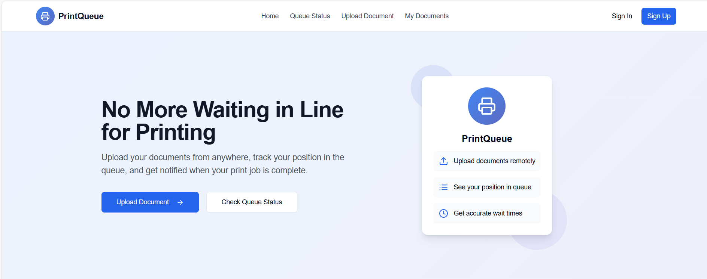

# 🖨️ PrintQueue - Smart Printer Management System

A live printer queue web application built to streamline document uploads, estimate wait times, and manage remote printing—especially designed for college environments.

---


## 💡 Project Overview

PrintQueue enables students and staff to:

- 📄 Upload documents from anywhere
- ⌛ See estimated wait times
- 🔄 Get live printer queue updates
- 🔒 Log in securely with custom authentication
- 🖨️ Manage print jobs efficiently

---

## What technologies are used for this project?

This project is built with:

- Vite
- TypeScript
- React
- shadcn-ui
- Tailwind CSS


```sh
# Step 1: Clone the repository using the project's Git URL.
git clone <YOUR_GIT_URL>

# Step 2: Navigate to the project directory.
cd <YOUR_PROJECT_NAME>

# Step 3: Install the necessary dependencies.
npm i

# Step 4: Start the development server with auto-reloading and an instant preview.
npm run dev
```


# Install frontend dependencies
npm i

# Start the development server
npm run dev